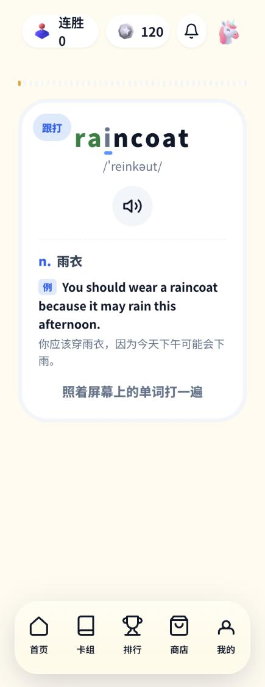
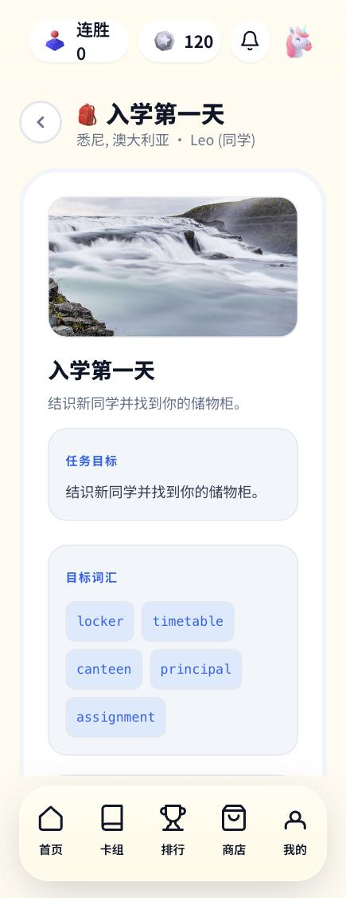
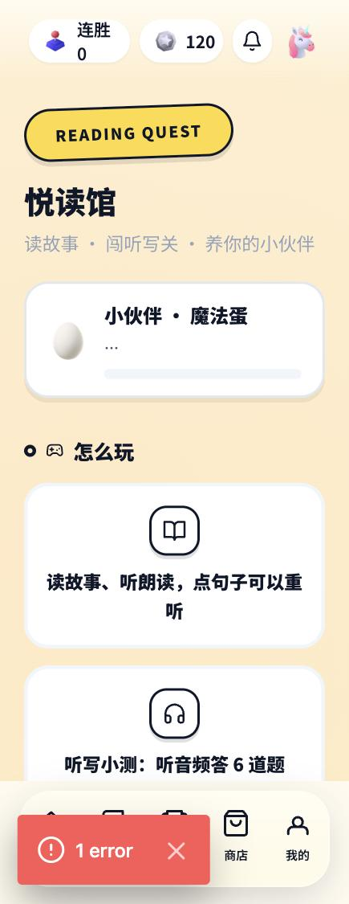
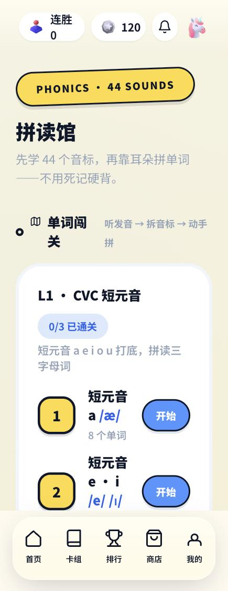
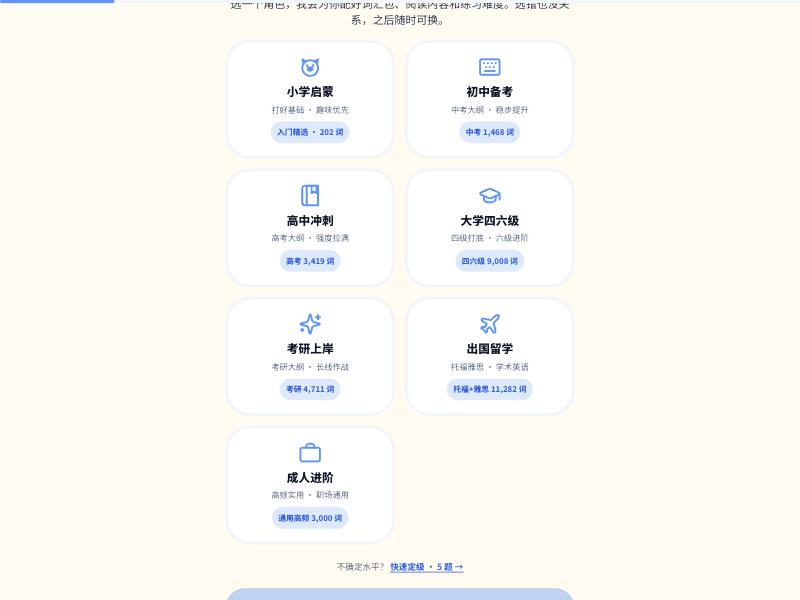

<div align="center">

# 漫豚英语 · mt-teach-app

**给中国 K12 孩子的游戏化英语练习 —— 场景对话 · 抽卡打字 · 悦读闯关 · 拼读馆**

[](LICENSE)
[](public/typing-dicts/LICENSE-DATA.md)
[](https://nextjs.org)

在线体验：[english.mt-health.com](https://english.mt-health.com)


</div>

---

漫豚英语是一款面向中国中小学生的游戏化英语练习应用。把「背单词、练句型、开口说」变成孩子愿意每天打开的游戏：抽卡集词、闯关喂宠物、跟读打分、场景对话——每一次练习都同时产出家长看得懂的「每日提分」。

## ✨ 功能一览

### 🃏 抽卡打字（Card Typing）
十连抽词卡 → 打字升星（跟打→辨义→听写→默写四步，N→R→SR→SSR）→ 错词自动进修复轮。歌词进度式逐字符着色、按键音效、通关播读单词；**FSRS-lite 复习调度**与「到期卡池」内建。




### 🎭 场景课程（四段式）
看示范 → 跟读评分（词级三色反馈 + 星级）→ 认单词 → 实战对话。每课一个真实场景（开学第一天 / 校园生活 / 旅行见闻…），由 LLM 生成剧情与目标词汇。



### 📖 悦读馆
分级英文故事 + 逐段朗读音频 + 听写小测闯关，收集「小伙伴」宠物喂养养成。



### 🔤 拼读馆
44 个音标 → CVC/CVCE 拼读关卡 → 听音辨词，先会读再会背。



### 🎓 学段角色与词汇分配
首次进入选择学段角色（小学/初中/高中/四六级/考研/出国/成人），系统自动分配对应词书与难度；支持 5 题快速定级反推建议角色。词库共 **11 本词书 · 81,000+ 词**（中考/高考/四六级/考研/托福/雅思/GRE/词频总集），全部免费开放。




## 🧱 技术栈

- **Next.js 14**（App Router）+ React 18 + TypeScript
- **Socket.IO** 班级 PK 实时对战
- **SQLite**（better-sqlite3）零外部数据库依赖
- **Web Audio** 合成音效 · MediaRecorder 录音 · SpeechRecognition 跟读
- 词库管线：[ECDICT](https://github.com/skywind3000/ECDICT) (MIT) → 过滤/分级/例句生成 → JSON 词书

## 🚀 快速开始

```bash
npm install
npm run dev        # http://localhost:3123
```

用演示账号 `13800000001` 登录（dev 模式下验证码直接回显）。

> 服务端 API（mt-teach-api）与本仓库为同构 Next.js 应用，`/app/api` 内已包含学生端所需的全部接口（经济系统/跟读评分/词卡同步）。

## 📦 词书数据

11 本分级词书与 81,000+ 词条词典索引随仓库分发（`public/typing-dicts/`），
生成管线见 `scripts/gen-*.mjs`。数据以 **CC BY-SA 4.0** 发布，来源与再加工说明见
[词书数据许可](public/typing-dicts/LICENSE-DATA.md)。

## 📄 License

- 代码：[Apache-2.0](LICENSE)
- 词书/词典数据：[CC BY-SA 4.0](public/typing-dicts/LICENSE-DATA.md)
- 致谢与来源：[NOTICE.md](NOTICE.md)

---

<div align="center">

**Keywords**: english learning, K12, gamified, flashcard, typing tutor, speech recognition,
FSRS, ECDICT, Next.js, China education, 初中英语, 高中英语, 背单词, 抽卡, 游戏化学习

</div>
